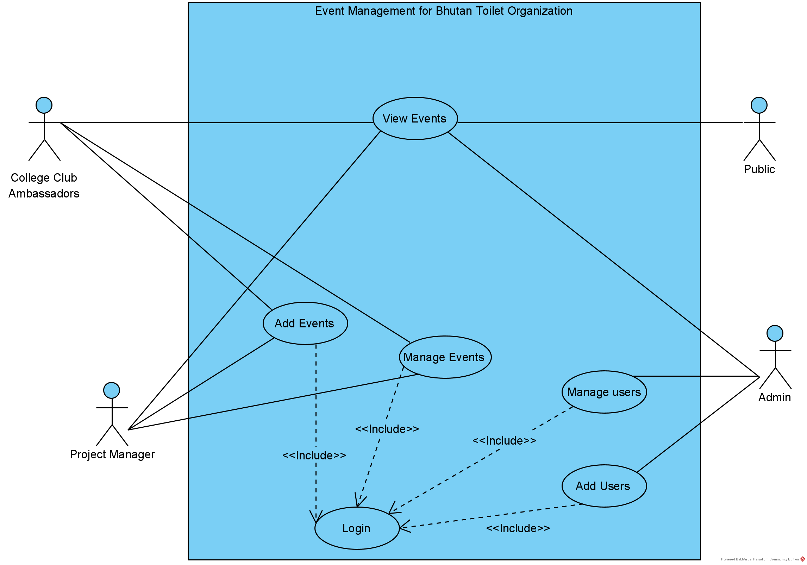

># Web Application Engineering 2021

#### _**Team Member:**_
1. Younten Tshering
2. Sai Preetham Kamishetty
3. Hekmatullah Sarwarzadah

# _**Project Topic: Event Management for social service: Bhutan Toilet Organization**_

>## Details of Project:

* General Public will get to know and participate in events that are organized and managed by the organization.

* The event will be automated and managed on the website where the Project Manager and College Club Ambassadors will be updating the event that they have created.

* The organization will be benefited from the system as they can keep track of events and reduce the workload of manual effort to communicate and announce the event information. The manual job of College Club Ambassadors will be automated, and it will help the organization to keep track of colleges providing services.

* As general users or the public, they will be informed about the events, and the organization can keep updated about the events and render help when needed.

>Usecase diagram

* The user of the system would be the administrator, Project Manager, College Club Ambassadors, staff, and the public.

* Any user on a smartphone will be able to access the website where he/she can log in if needed and see events or manage the events based on privilege.

* Since College Club Ambassadors must manually update about the event held to the organization. Therefore, the project manager or organization does not have to manually maintain the details of the event in excel once the system is in place.

* The magnet content of the application will be coming from the College Club Ambassadors and the project manager of the organization.

># Intellectual property
1. File a Copyright
2. Source Code Licenses

### Generally, the software is protected under copyright law. When a software developer writes any code, we can retain the ownership or copyright of the software. Then, owning the copyright we can License the copyright to others for use under certain terms and conditions.
### Therefore, in copyright legislation around the world, the source code is considered the intellectual property of the creator. Source code is protected in the same way as a “literary work”, which means it is copyrightable from the moment that the first line of code is created.

># To understand more about the Organization:

https://www.bhutantoilet.org/

># Vision
Adequate WASH for all

># Mission
Make clean and safe toilets accessible for all and inspire behavioral change by building public awareness and citizen volunteerism.